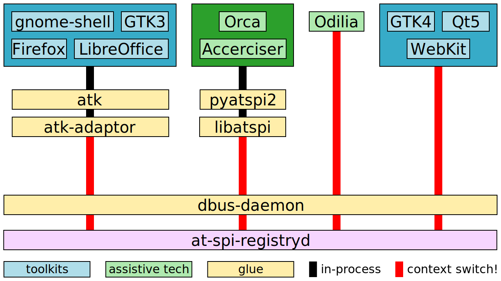

Architecture of the accessibility stack
=======================================

The diagram above shows how the various modules for accessibility
communicate with each other.  The modules at the top are those with
which users interact: GUI toolkits for applications and screen
readers.  The rest of the modules are infrastructure.

The diagram has modules grouped in vertical bands like this:

* Old toolkits: gnome-shell, GTK3, Firefox, and LibreOffice all use
  atk and atk-adaptor, to talk via DBus, to at-spi-registryd and
  assistive technologies like screen readers.

* Modern toolkits: GTK4, Qt5, and WebKit talk DBus directly
  instead of going through atk's intermediary layer.

* Orca and Accerciser (and Dogtail, which is not in the diagram) are
  the counterpart to the applications; they are the assistive tech
  that is used to perceive applications.  They use libatspi and
  pyatspi2 to talk DBus, and to keep a representation of the
  accessible objects in apps.

* Odilia is a newcomer; it is a screen reader written in Rust, that
  talks DBus directly.

Modules which are in-process are connected by black bands, for example
there are black bands in sequence between GTK3, atk, and atk-adaptor.
The latter two are libraries just linked along with GTK3, so all
communication between those modules is just in-process function calls.

The diagram has red bands to show where context switches happen when
communication goes out-of-process, i.e. when applications and screen
readers communicate.  For example, whenever something happens in
gnome-shell, there is a context switch to dbus-daemon, and another
context switch to Orca.  The accessibility protocol is very chatty,
with a lot of going back and forth, so these context switches probably
add up — but we don't have profiling information just yet.

Also, some of the modules or layers in each vertical band can probably
be removed.  For example, as of 2023/Jun/22 there is work being done
to `remove Orca's use of pyatspi2
<https://gitlab.gnome.org/GNOME/orca/-/issues/300>`_, and to use the
atspi library directly.

The following sections describe what happens between **pairs of
modules**, for example, between atk and atk-adaptor, or between atspi
and pyatspi2.

Old toolkits that still use atk
-------------------------------

GTK2, GTK3, gnome-shell, Firefox, Chromium, LibreOffice, and Java
Swing are made accessible by implementing the GObject interfaces
defined in atk.

To make a toolkit accessible means adding a way to
extract information from it in a standard way; you don't want screen
readers to have separate implementations for GTK, Qt, St, Firefox,
etc.

For every window, regardless of toolkit, you want to have a
"list children" method.  For every widget you want "get accessible
name", so for a button it may tell you "OK button", and for an image
it may tell you "thumbnail of file.jpg".  For widgets that you can
interact with, you want "list actions" and "run action X", so a button
may present an "activate" action, and a check button may present a
"toggle" action.

Atk and atk-adaptor
-------------------

However, ATK is just abstract interfaces for the benefit of toolkits.
We need a way to ship the information extracted from toolkits to
assistive tech like screen readers.  The atspi protocol is a set of
DBus interfaces that an application must implement; atk-adaptor is an
implementation of those DBus interfaces that works by calling atk's
slightly different interfaces, which in turn are implemented by
toolkits.  Atk-adaptor also caches some things that it already asked
to the toolkit, so it doesn't have to ask again unless the toolkit
notifies about a change.

If this seems like too much translation is going on, that's because it
is!  One goal in the accessibility overhaul is to remove these
redundant layers, which grew out of compatibility concerns at various
points in time.

atk-adaptor, dbus-daemon, and libatspi
--------------------------------------

So, atk-adaptor ships the information via the DBus daemonf (either the
original dbus-daemon or newer implementations like dbus-broker).
What's on the other side?  In the case of Orca it is libatspi, a
hand-written binding to the DBus interfaces for accessibility.

Libatspi also keeps an internal representation of the information that
it got shipped from the toolkit.  When Orca asks, "what's the name of
this widget?", libatspi may already have that information cached.  Of
course, the first time it does that, it actually goes and asks the
toolkit via DBus for that information.

libatspi and pyatspi2
---------------------

But Orca is written in Python, and libatspi is a C library.  Pyatspi2
is a Python binding for libatspi.  Many years ago we didn't have an
automatic way to create language bindings, so there is a hand-writtten
"old API" implemented in terms of the "new API" that is auto-generated
via GObject Introspection from libatspi.

Pyatspi2 also has a bit of logic which should probably not be there,
but rather in Orca itself or in libatspi.

Note the `work to remove Orca's use of pyatspi2
<https://gitlab.gnome.org/GNOME/orca/-/issues/300>`_.  This may allow
us to remove pyatspi2 from the stack for end-users very soon; it still
needs to be kept around for developers who use tools like Accerciser,
which also use pyatspi2.

Screen readers and other Assistive Technologies (ATs)
-----------------------------------------------------

Finally we get to Orca, a screen reader written in Python.  Orca uses
speech synthesis to read out loud the names of widgets, their
available actions, and generally any information that widgets want to
present to the user.  It also implements hotkeys to navigate between
elements in the user interface, or a "where am I" function that tells
you where the current focus is in the widget hierarchy.

ATs that do not use libatspi
----------------------------

In the diagram, Odilia is the only screen reader that connects
directly to dbus-daemon instead of going through the legacy layers of
pyatspi2 and libatspi.  Odilia calls the atspi APIs via DBus directly.
(Implementation detail: Odilia is written in Rust, and uses zbus as
its Rust-only implementation of dbus).

Toolkits that do not use atk
----------------------------

Modern toolkits like GTK4, Qt5, and WebKit call the DBus APIs for
atspi directly, instead of using atk's intermediate layer.  Their job
then becomes to translate their own toolkit concepts into atspi
concepts.  This is in contrast to toolkits which still use atk, which
must translate their own concepts into atk, and then atk-adaptor
translates *that* into atspi concepts.
